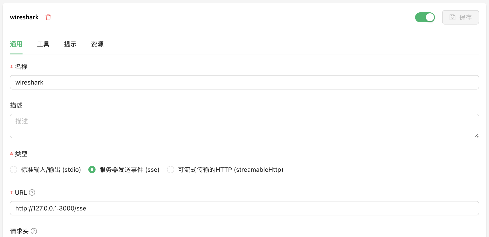
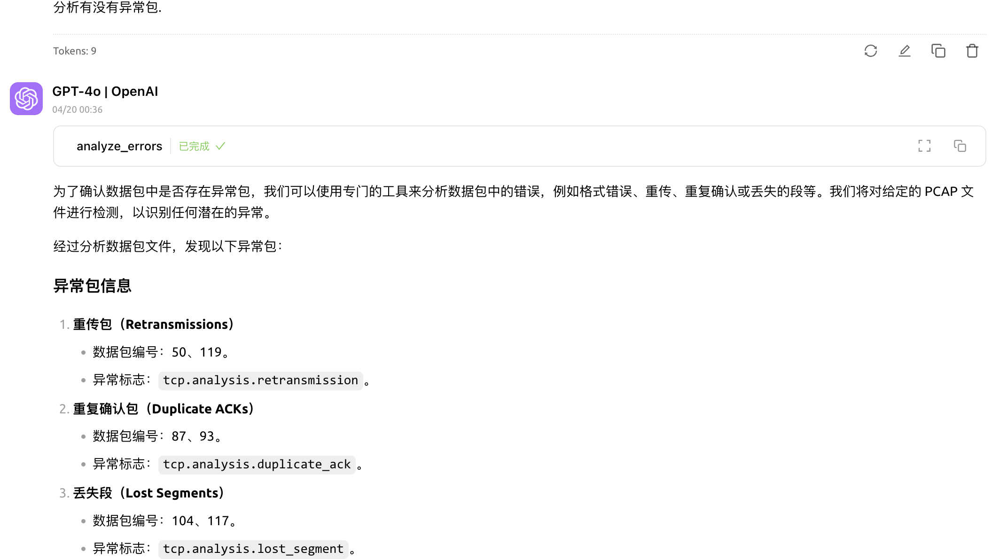
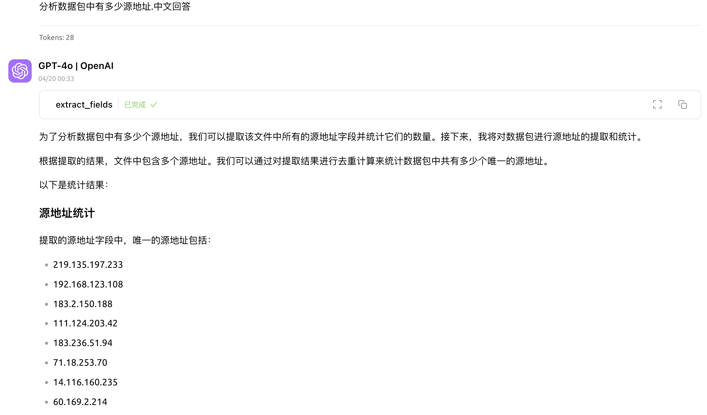

# Wireshark MCP

Wireshark MCP 是一个基于 Model Context Protocol (MCP) 的服务器，允许 AI 助手通过 tshark 命令行工具与 Wireshark 进行交互。它将 Wireshark/tshark 的强大功能与大语言模型(LLM)的智能分析能力相结合。通过 Model Context Protocol (MCP)，该工具能够让 AI 助手直接与 tshark 进行交互，实现智能化的网络数据分析。

## 功能特性

### 基础功能
- AI 驱动分析：突出自然语言交互、智能异常检测等特性
- 交互方式：详细说明对话式分析、智能过滤和结果解读功能
- LLM 增强功能：描述了协议分析、安全分析、性能诊断和统计分析等增强功能

## 系统要求

- Python 3.9 +
- Wireshark/tshark
- MCP SDK

## 安装

1. 确保已安装 Wireshark 和 tshark:
2. 安装 Python 依赖:
```bash
pip install -r requirements.txt
```
## 使用方法

1. 启动 MCP 服务器:
```bash
python wireshark_mcp.py 
```

2. 访问状态页面查看服务状态和工具说明:
```
http://127.0.0.1:3000/status
```

3. 配置客户端 MCP 服务器:



配置说明：
- 名称：wireshark
- 类型：服务器发送事件 (sse)
- URL：http://127.0.0.1:3000/sse

## 使用效果



## 其他

- 数据包数量限制：默认限制为 5000 个数据包
- 有点意思,不过意思不大,太耗大模型 tokens,还不用调用 tshark 命令直接查.

## 许可证

Apache License 2.0 

## 特别感谢
https://mp.weixin.qq.com/s/G_6efZFEgGTeOcRtyaNS1g?poc_token=HKpP_2ejJpvhJJ4EJ9J-8b9U5eZ3U0Jvkk_YPKoO
https://github.com/shubham-s-pandey/WiresharkMCP
